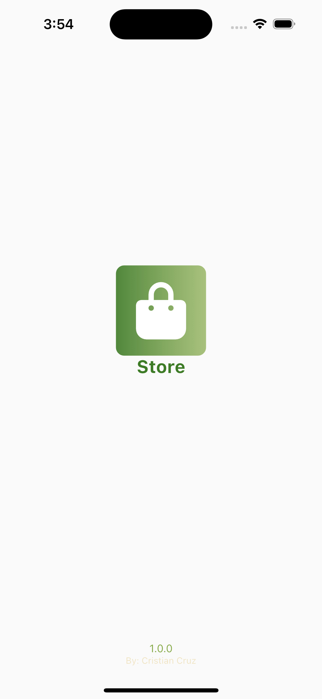
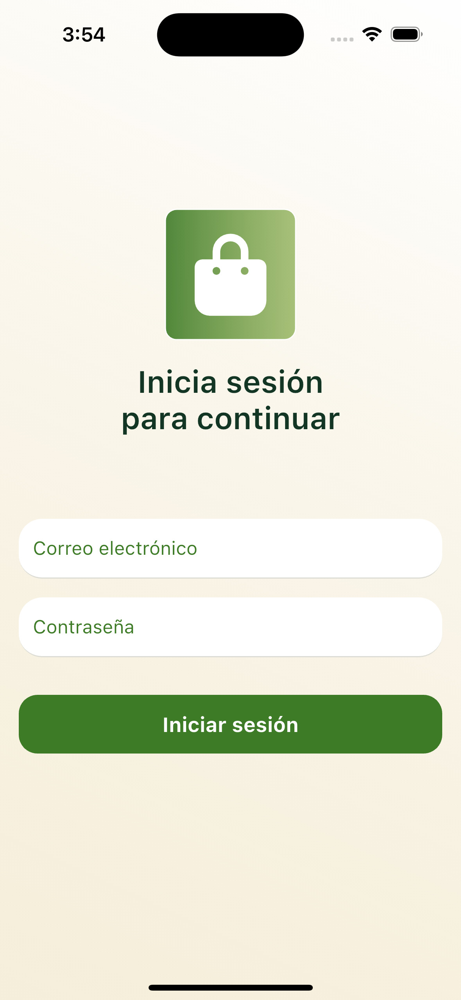
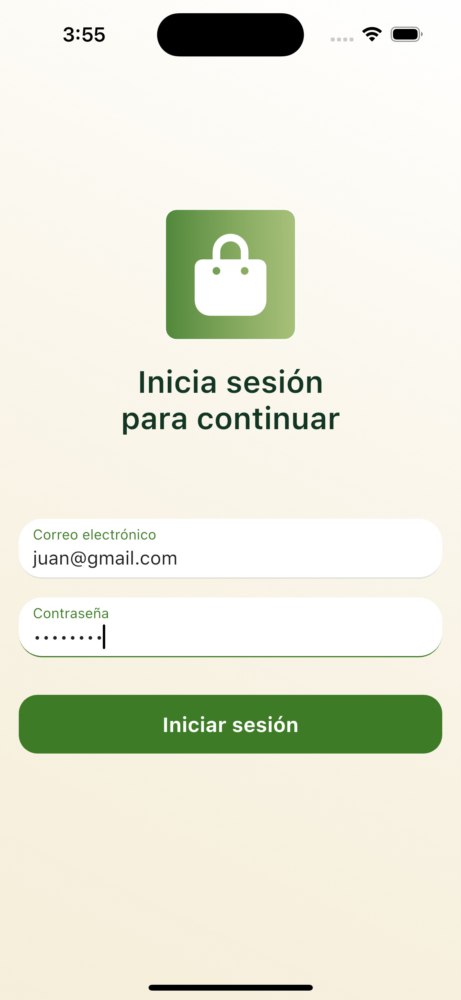

# onrapp test

[](https://flutter.dev)
[](LICENSE)
[](https://flutter.dev)
[](https://github.com/cristiancamilo070/onrapp_test/commits/main)
[](https://github.com/cristiancamilo070/onrapp_test/issues)
[](https://github.com/cristiancamilo070/onrapp_test)

## Running the Flutter Project Locally

To run this Flutter project locally, follow these steps:

- Make sure you have Flutter and Dart installed on your machine.
- Clone the GitHub repository to your local machine using the following command:

```bash
git clone https://github.com/cristiancamilo070/onrapp_test.git
```

- then run

```bash
flutter pub get
```

```bash
flutter run
```

# Frontend Overview

<div style="display: flex; flex-wrap: wrap; justify-content: space-between;">
  
  
  
</div>
<div style="display: flex; flex-wrap: wrap; justify-content: space-between;">
  
  
  

## Clean Architecture and Code

This Flutter frontend follows the principles of Clean Architecture and Clean Code, providing a structured and maintainable codebase.

---

## Overview

This Flutter project demonstrates a simple application with a clean architecture approach. The app includes the following functionalities:

1. **Login Screen**:

   - Email and password input fields with validation.
   - Simulation of an authentication process with a loading indicator.
   - Navigation to the product list upon successful login.

2. **Product List Screen**:

   - Fetches and displays products from [FakeStore API](https://fakestoreapi.com/products).
   - Displays product details such as:
     - Title.
     - Short description (limited to 2 lines).
     - Price in USD.
   - Allows navigation to a detailed view of each product by tapping on the product card.

3. **Product Detail Screen**:
   - Fetches and displays detailed information for a selected product using [FakeStore API](https://fakestoreapi.com/products/:id).
   - Displays:
     - Product image.
     - Title.
     - Full description.
     - Price.
     - Category.
     - Rating (with stars and number of reviews).
   - Includes a back button for navigation to the product list.
